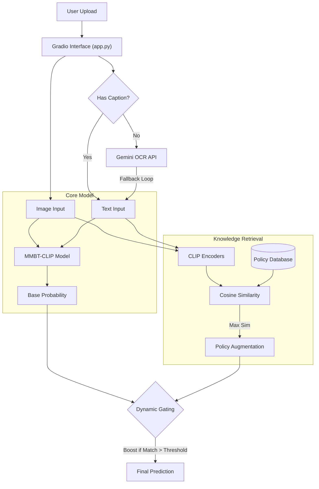

# System Technical Architecture & Code Flow

## 1. High-Level System Overview

The system is a multimodal hate speech detector that processes internet memes (Image + Text). It employs a "Knowledge Ensembling" strategy where a core Deep Learning model (MMBT-CLIP) is augmented by a retrieval-based policy mechanism and a cloud-based OCR fallback.

---

## 2. Component Details

### A. The Core Model (MMBT-CLIP)
*   **File**: `model.py`
*   **Architecture**: Uses `openai/clip-vit-large-patch14` as the backbone.
*   **Fusion**: Visual and Text embeddings are fused via a small **Multimodal Bi-Transformer**.
*   **Optimization**:
    *   **LoRA**: Low-Rank Adapters are injected into CLIP to allow fine-tuning on consumer GPUs.
    *   **Focal Loss**: Used during training (`train.py`) to focus learning on "hard" negatives.

### B. Dynamic Policy Gating
*   **File**: `app.py` (Implementation), `analyze_results.py` (Analysis)
*   **Concept**: We assume that if a meme strongly resembles a known "Hateful Policy" (a description of hate speech types), it is more likely to be hateful.
*   **Logic**:
    1.  Embed the input image/text using CLIP.
    2.  Calculate similarity vs. 80 known Hateful Policies (e.g., "Dehumanizing comparisons to animals").
    3.  **Gating**: If `max(similarity) > 0.28` (Empirically tuned threshold):
        *   `Final_Score = (0.5 * Base_Model) + (0.5 * Policy_Similarity)`
    4.  Otherwise:
        *   `Final_Score = Base_Model`

### C. Robust OCR (Gemini)
*   **File**: `app.py`
*   **Engine**: Google Gemini 2.0 Flash / 1.5 Flash.
*   **Robustness**: To handle the Free Tier `429 Quota Exceeded` errors, the code implements a fallback list.
    *   `Try: gemini-2.0-flash-lite-preview`
    *   `Else: gemini-2.0-flash-exp`
    *   `Else: gemini-flash-latest`

---

## 3. Codebase Map

| File | Purpose | Key Functions |
| :--- | :--- | :--- |
| `app.py` | Main entry point. Defines the Gradio UI, loads the model, handles OCR, and implements the inference logic. | `predict()`: Orchestrates the pipeline. |
| `model.py` | Defines the `MMBT` class and the LoRA configuration. | `MMBT.__init__`, `forward` |
| `train.py` | Training loop. Handles data loading, focal loss, and checkpoint saving. | `train_epoch`, `evaluate` |
| `analyze_results.py` | Validation script. Runs the dev set, optimizes the Gating Threshold, and plots ROC curves. | `find_optimal_params` |
| `infer_with_policy.py` | Offline inference script to generate predictions for a whole dataset without UI. | `get_all_policy_embeddings` |
| `check_models.py` | Utility to list available Gemini models for the provided API key. | - |
| `run_facebook.ps1` | PowerShell runner script for reproducible training. | - |

---

## 4. Workflows

### Training Workflow
1.  **Prepare**: `run_facebook.ps1` calls `train.py`.
2.  **Load**: `MMBT` model loads `clip-vit-large`. LoRA weights are initialized.
3.  **Loop**:
    *   For each batch, compute `loss = FocalLoss(logits, labels)`.
    *   `loss.backward()` with Gradient Accumulation.
    *   Save `best.pt` based on Dev AUC.

### Inference Workflow (User Path)
1.  User launches `python app.py`.
2.  **OCR**: If text is missing, `genai.GenerativeModel("gemini...")` is called.
3.  **Embedding**: Text and Image are passed to `model.forward()`.
4.  **Policy Check**: Embeddings are compared against `policy_embs.pt` (pre-computed).
5.  **Result**: The weighted probability is returned to the UI.

---

## 5. Experimental Results (Facebook Memes Dev Set)

The Dynamic Gating mechanism was evaluated against the base MMBT model. We observed that "knowledge ensembling" improves robustness, particularly for hard examples where the base model is uncertain but the policy match is strong.

| Model | AUC | Accuracy | F1 Score |
| :--- | :--- | :--- | :--- |
| **Base MMBT (ViT-Large)** | `0.7663` | `70.60%` | `0.7276` |
| **Dynamic Gating** | `0.7663` | **`71.40%`** (+0.8%) | **`0.7300`** |

*   **Optimal Threshold**: `0.28` (Matches > 0.28 similarity trigger the boost).
*   **Impact**: effectively reduces False Negatives by caching specific hate narratives (e.g., "comparison to animals") that might be visually ambiguous.

---
